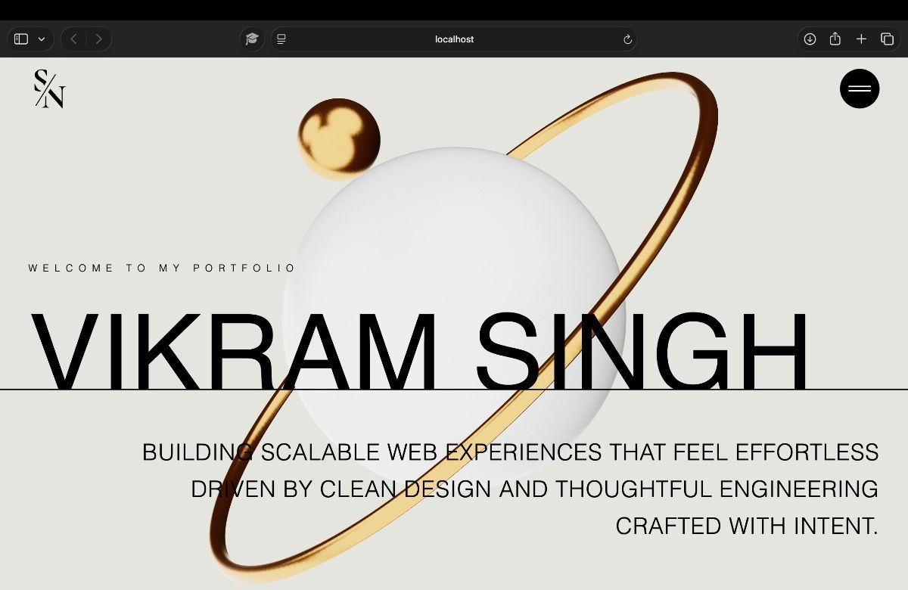

# Orbit Luxe Portfolio
# Author: Vikram Singh
A modern, minimal, and premium personal portfolio website built with **React** and **Vite**.  
It is designed to present projects, skills, services, and contact details with a clean visual style and smooth UI experience.

## Preview


`

## Features

- Elegant hero section with strong visual branding.
- Smooth and responsive layout.
- About, services, works, and contact sections.
- Custom animated components and modern styling.
- Optimized for a polished portfolio presentation.
- Easy to customize for personal branding.

## Tech Stack

- React
- Vite
- JavaScript
- CSS
- Custom fonts
- Modern responsive design

## Project Structure

```bash
├── public/
│   └── fonts/
├── src/
│   ├── components/
│   ├── constants/
│   ├── sections/
│   ├── App.jsx
│   ├── index.css
│   └── main.jsx
├── index.html
├── package.json
└── vite.config.js
```

## Getting Started

### 1. Clone the repository

```bash
git clone https://github.com/Babamosie333/OrbitLuxe-Portfolio.git
cd halo-orbit-portfolio
```

### 2. Install dependencies

```bash
npm install
```

### 3. Run the development server

```bash
npm run dev
```

### 4. Build for production

```bash
npm run build
```

### 5. Preview the production build

```bash
npm run preview
```

## Customization

You can customize the portfolio by updating:

- `src/constants/index.js` for text and content.
- `src/sections/*` for section layout and content.
- `src/index.css` for colors, spacing, and typography.
- `public/fonts/` for custom font files.

## Open Graph Image

If you want social sharing previews, place your OG image inside `public/` and reference it in `index.html`.

Example:

```html
<meta property="og:title" content="Orbit Luxe Portfolio" />
<meta property="og:description" content="A modern portfolio website built with React and Vite." />
<meta property="og:image" content="/og-image.png" />
<meta property="og:type" content="website" />
```

## Live Demo

- [https://orbitluxe.vercel.app](#)
- [https://github.com/Babamosie333/OrbitLuxe-Portfolio.git](#)

## License

This project is open source and available under the MIT License.